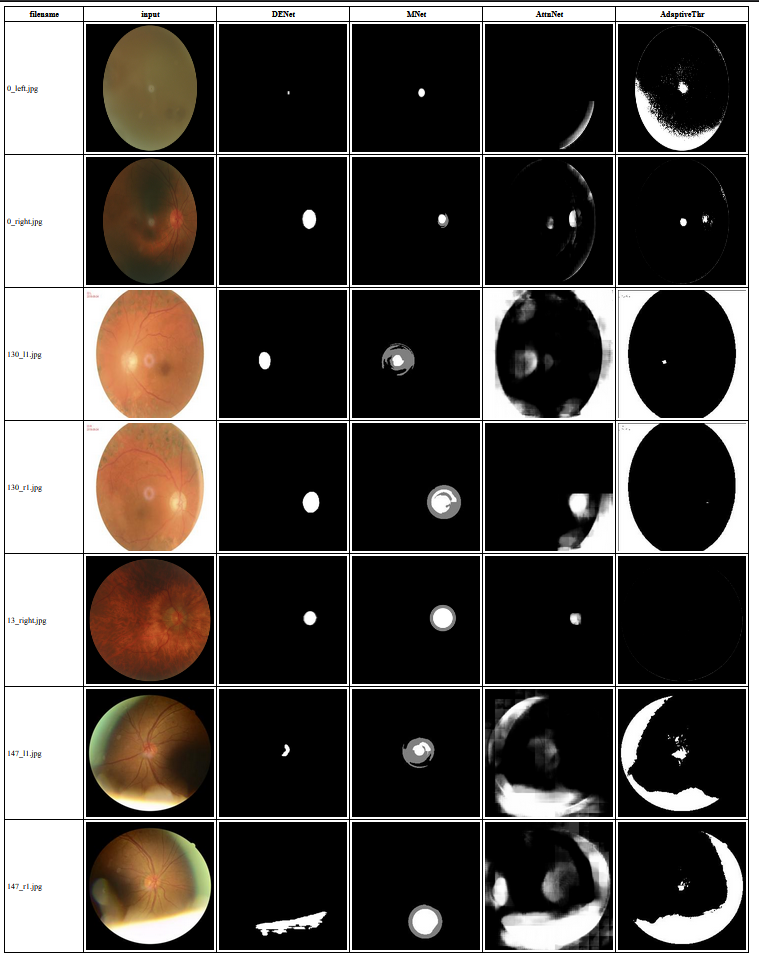

# Zoo of Fundus Disc Segmentation Methods
This repository provides a zoo of different methods for sementing the disc in retina Fundus images. The aim of this to make a consistent test environment for different methods. In addition, this environment would be ready to use easily. 

with _index.html_, you can summarize and browse all the results in a one html table. As you can see, the results are so different by different methods.   Notice that, each method is trained on different datasets and so we can not report their performance on a new dataset as a benchmark.
For that reason you may need to retrain th models on your dataset. Consider their repositories for training process. 

## requirements
The codes are modified to be used easily with CPUs too and you don't need to have GPU.  
You just need to install the requirements, with conda or pip, either you prefer.  
Use _requirements.txt_ or _requirements_conda.txt_ respectively.

## Usage
for each method, there is a main.py file and you can use them with appropriate arguments (path of input images and results). for example:

> python main_DENet.py --img_dir ./tmp_images  --result_dir ./results_DENet

finally, you can make a summerization of the results by:
> python main_html.py 

View the generated index.html file in a browser.

## Sources
Notice that, the collected librarris folder, contains the required files to run each method in which copied from the source repositories. Therefore all rights and responsibilities of the each method and corresponding library is reserved by their own developer.

See the sources repositories and make sure yo consider themselves too:

**DENet:**  
    DENet_GlaucomaScreen  
    https://github.com/HzFu/DENet_GlaucomaScreen
    https://doi.org/10.1109/TMI.2018.2837012
    https://doi.org/10.1109/TMI.2018.2791488

**MNet:**  
    mnet_deep_cdr     
    https://github.com/HzFu/MNet_DeepCDR
    https://doi.org/10.1109/TMI.2018.2791488

**AttnUnet:**  
    Optic-Disc-Unet 
    https://github.com/DeepTrial/Optic-Disc-Unet
    https://arxiv.org/pdf/1804.03999v3.pdf

**Adaptive Threshold:**  
    Cup-and-disc-segmentation-for-glaucoma-detection-CDR-Calculation-  
    https://github.com/NupurBhaisare/Cup-and-disc-segmentation-for-glaucoma-detection-CDR-Calculation-
    https://doi.org/10.1109/SPIN.2015.7095384 

## Citing

make sure, to cite the proper method with the provided doi above. Also, for citing this repository you can use following reference:

